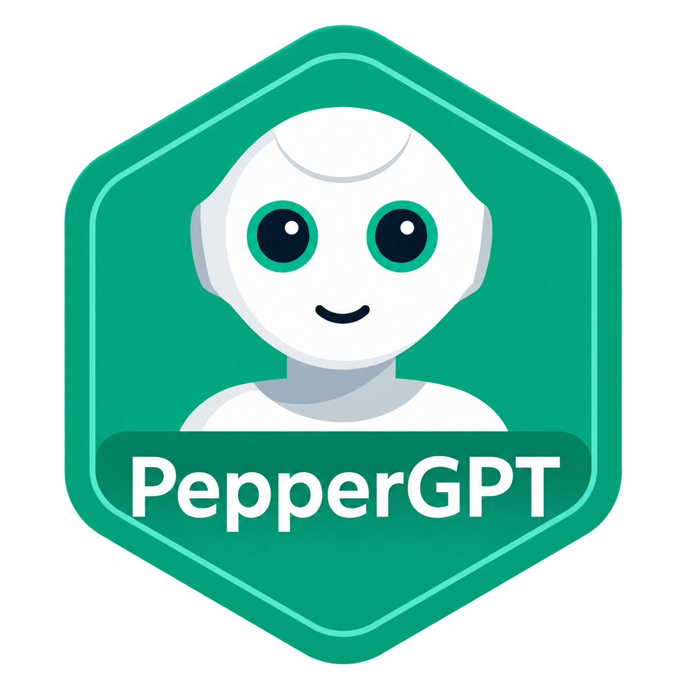

# PepperGPT



**Talk to a robot, ask questions, share stories and explore ideas together.**

Pepper is a human-shaped robot made by SoftBank Robotics. She has a face, moving arms and a tablet on her chest, and is designed to interact with people.

PepperGPT is an app that brings conversational AI, like ChatGPT, to Pepper. Instead of typing into a chat window, you speak to her. She answers aloud, moves her arms as she speaks, and uses her tablet to show messages and pictures.

You can have a conversation in English or Italian, ask her to tell an illustrated story, find a recipe, create a picture, check the weather or play internet radio. You can also choose her voice and personality, and interrupt her speech by touching her head or hand.

PepperGPT uses OpenAI's AI models and adds robot interaction and these activities around the conversation. It is a community project, rather than an official ChatGPT application.

The app runs on Pepper without a companion PC. AI conversation, OpenAI voices and image generation need an Internet connection and your own OpenAI API key.

## What PepperGPT does

- **Voice conversation:** talk with Pepper in English or Italian, with conversation history shown on her tablet.
- **Voice and personality choices:** use Pepper's native voice or the current integration's OpenAI Coral/Marin voices; choose a personality preset or write your own prompt.
- **Illustrated storytelling:** Pepper narrates a story while generated illustrations appear on the tablet.
- **Recipes:** request cooking ideas with written instructions and an accompanying picture.
- **Creative images and photos:** generate illustrations or use Pepper's camera for imaginative photo transformations.
- **Weather and time:** ask about conditions or the time in a city, with a configurable default city.
- **Internet radio:** open a dedicated player with station buttons, volume controls and optional dance animations. Flexible listening requests can be interpreted through the configured chat model.
- **Embodied interaction:** contextual speaking gestures, head/hand touch to interrupt speech, and face following through Pepper's native awareness.

The current robot integration also provides an ENG/ITA conversation switch, voice-volume controls, themes and full-image viewing. Menus remain in English when Italian conversation is selected.

For example, you can say:

- “Tell me a story about a robot exploring the moon.”
- “Dammi una ricetta per la pasta.”
- “What's the weather today?”
- “Pepper, metti della musica di sottofondo.”

These capabilities describe the restored robot integration. The source release contains separate development and integration baselines, explained below.

## Project status

This is a **source-only release**. It does not include an installable APK or anyone's credentials.

| Location | What it contains |
| --- | --- |
| `Android/PepperGPT` | The cleaned 2.8.x development app, including native Pepper speech, model settings and semantic radio recognition. |
| `tools/stable-voice` and `tools/patch-*.py` | Integration helpers for the separate restored 2.7.x app, including streamed OpenAI voices, ENG/ITA support, touch interruption and speech gestures. |

**Building the Gradle development app does not yet reproduce the complete restored integration.** Its OpenAI voice and language-switch helpers are not wired into that build. Integration helpers share `ModelSettings.java` and `RadioIntent.java` from the development source. Older private APKs are excluded because they may embed credentials.

The slow offline Cori engine has been removed. Native Pepper speech and OpenAI Coral/Marin remain available in the restored integration.

## Requirements and configuration

Pepper's tablet runs **Android 6.0 / API 23 on 32-bit ARMv7**. The app uses Pepper's QiSDK robot connection for robot interaction.

In Settings, provide:

- Your OpenAI API key for AI conversation and creative features.
- Your OpenWeather API key for weather.
- A default city and your preferred personality.
- Optional robot SSH settings with a verified SSH host key, where required by the existing robot helpers.

In **Settings > AI models**, you can specify separate model IDs for conversation, stories/recipes and image analysis. The defaults remain `gpt-5-nano`, `gpt-5-mini` and `gpt-5-mini`. Blank fields use those defaults; Restore defaults fills them for review before Save. Speech and generated-image models are separate.

Custom models must support the API features used by their module, including Chat Completions, image input for vision, and function calling for semantic radio recognition. Account access, usage costs and future API compatibility depend on the selected models. A new API contract may require a code update.

Unambiguous short radio commands are handled locally. More flexible audio-related wording uses an isolated intent request to the configured chat model; it can add several seconds. Ordinary conversations and the other feature APIs keep their existing request/response format.

## Build the development app

Use Java 11, Gradle 7.2, Android Gradle Plugin 7.1.3, Kotlin 1.4.0, Android SDK 28 and Build Tools 30.0.3.

Open `Android/PepperGPT` in Android Studio, or copy its `local.properties.example` to `local.properties` and set your own SDK path. From that directory, run:

```powershell
.\gradlew.bat :app:assembleDebug :app:testDebugUnitTest
```

Use the ARMv7 APK for Pepper; x86 is not the tablet ABI. Build outside a synchronized directory if generated files are locked. See the baseline distinction above before deploying a development build over an existing installation.

## Validation and privacy

The development build and fourteen unit tests passed. Separate checks cover Italian feature routing and semantic radio intent; a user confirmed that an indirect Italian request opened the player and produced audible music on Pepper. This is not a full physical regression of every module. See `CODE_REVIEW.md` for scope and remaining limitations.

Personal configuration, conversation history, logs, recovery files, credentials, signing keys and private APKs are excluded from this repository. Use your own credentials and keep them out of Git. See `SECURITY.md` and `THIRD_PARTY.md` for security notes and component attribution. Existing asset and dependency rights are not reassigned.
